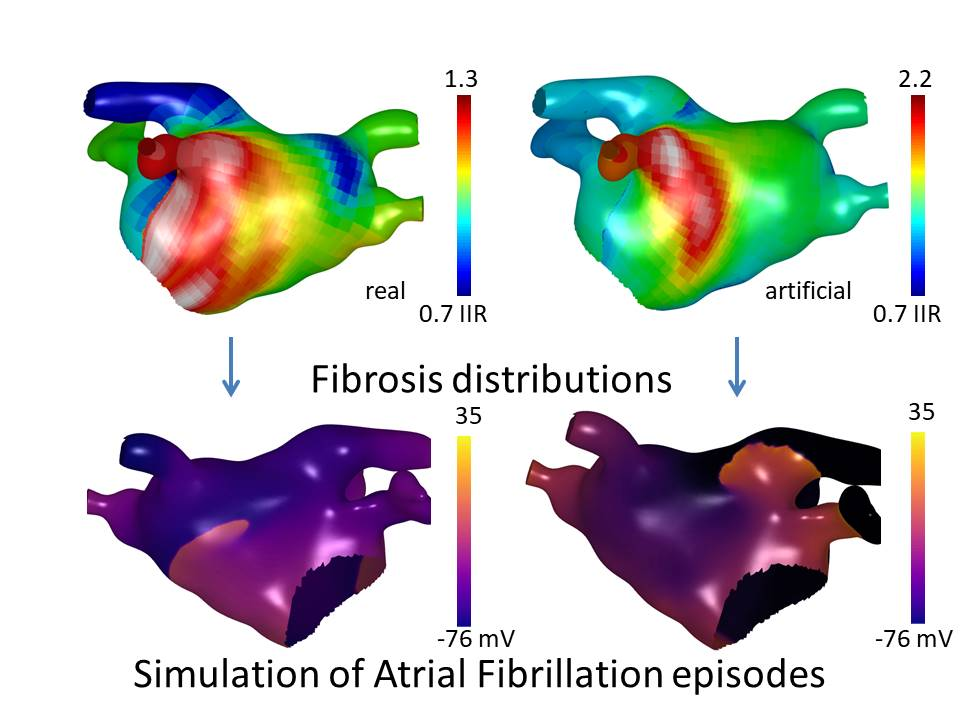

# cinc23_qmul

### Atrial Fibrosis Distribution Generation Based on the Diffusion Models

The paper was presented at Computing in Cardiology conference (CinC 2023).

### Abstract
  
Deep learning (DL) models have the potential to accurately predict atrial fibrillation (AF) ablation outcomes based on patient-specific anatomical and physiological features, including fibrotic remodelling. 
However, it is challenging to collect enough data for training deep learning models using clinical data alone. 
With this motivation, we developed a method to artificially generate additional datasets. 
In this study, we aim to generate artificial atrial fibrosis distributions via diffusion models to increase our training dataset size by imitating independent personalized AF episodes. 
%Specifically, a Denoising Diffusion Probabilistic Model was trained on real fibrosis distributions to generate 100 artificial fibrosis distributions using a 2D representation of the atria (Universal Atrial Coordinates).  

We validated the proposed method by applying a DL binary classifier, which predicts whether AF is sustained post-PVI ablation.
Fibrosis and dominant frequency maps extracted from pre-ablation AF simulations were used as inputs to predict AF sustainability after PVI.
We compared training a binary classifier on generated fibrosis data to training it on 100 real fibrosis distributions on the same LA anatomy. 
For the baseline classifier trained and tested on real fibrosis data, the ROC-AUC score was 0.96. 
In contrast, training the classifier using generated cases, and testing on the real fibrosis data, resulted in an ROC-AUC score of 0.92. 
The results indicate that the artificial fibrosis distributions correspond well with the real ones and can be used for dataset expansion. 




The proposed methodology served as a cornerstone for a large in-silico study using synthetic fibrosis distributions for biophysical simulations of AF and predicting outcomes of AF ablation procedures.
The paper is now under review in Frontiers in Cardiovascular Medicine, Generative Artificial Intelligence in Cardiac Imaging and Cardiovascular Medicine.

## Fibrosis generation

```
python generation.py config.yaml name_of_experiment
```


## AF preprocessing and classification 

```
python classif.py config_classif.yaml name_of_experiment_classification
```
